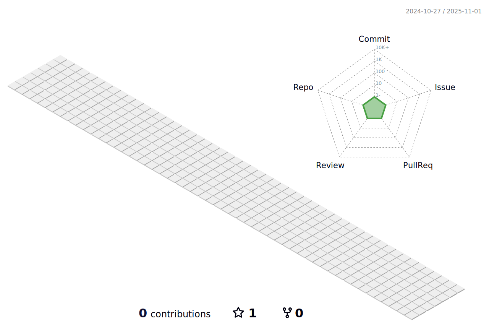

<h1 align="center">Hi 👋, I'm szak/Eggngineer</h1>
<h3 align="center">Majoring Information Technology (especially Computer Vision) in Japan</h3>

connect me!

  

<h1>😎About Me</h1>

- 🌱 I’m currently learning **Point Cloud Registraton**

- 👨‍💻 All of my projects are available at [https://eggngineer.github.io/blog/](https://eggngineer.github.io/blog/)

- 📝 I regularly write articles on [https://zenn.dev/e_gg_ngineer](https://zenn.dev/e_gg_ngineer)

- 💬 Ask me about **python and shellscript**

- 📫 How to reach me **eggngineer@gmail.com**

<h1 align="left">Languages and Tools:</h1>

                  

